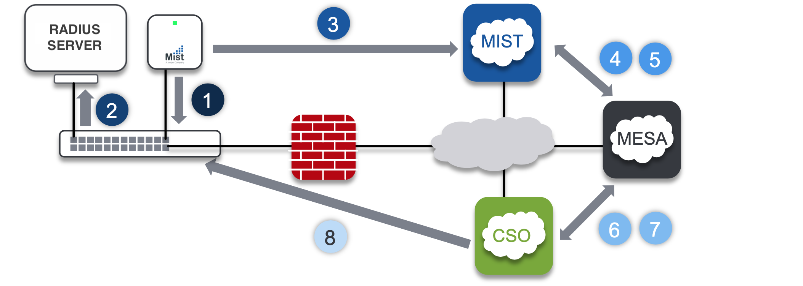

# Introduction
Mesa script is a script designed to update the switchport configuration on a Juniper EX switch when a Mist Access Point is connected to it.

It is composed of lightweight python web server ([Flask](https://github.com/pallets/flask)) and python code to process the webhook information and change the switchport configuration.

The switchport configuration can be done through
* Juniper CSO
* directly on the switch by using PyEZ.

This script is available as is and can be run on any server with Python3. 
The script is also available as a Docker image. It is designed to simplify the deployment, and a script is available to automate the required images deployment.

# IMPORTANT
To get this script working, you will have to manually configure webhooks on your Mist account and enable the "device-events" topic. This configuration can be done at the Organization level, or at the site level, depending on your needs.

This will tell Mist Cloud to send AP events (like AP Connected/Disconnected) to the MESA FQDN. As of today (January, 2020), it is not possible to enable "device-events" topics directly from the Mist UI. This configuration can be done through Mist APIs. You can use the web UI to manage APIs by reaching https://api.mist.com/api/v1/orgs/:your_org_id/webhooks or https://api.eu.mist.com/api/v1/orgs/:your_org_id/webhooks (Be sure to replace ":your_org_id" first). Then you will be able to create a new webhook by using the following settings:

`
    {
        "url": "https://<mesa_server_fqdn>/<mesa_url>",
        "topics": [
            "device-events"
        ],
        "enabled": true
    }
   `

# How it works

The following steps are explaining the communication when using CSO integration.
1. When an admin connects an AP on any switchport (1) , the switch is using MAC authentication, and the RADIUS server is returning a VLAN id allowing the AP to contact the Mist Cloud (1’)
2. Once the AP connects the Mist Cloud, it will report the switch LLDP information (hostname, switchport desc, …) (2)
3. At the same time, Mist Cloud is sending a webhook message to the MESA server indicating this AP just connects (3)
4. MESA server will use Mist APIs to get more information, especially the switch hostname and the switchport (4)
5. MESA server will contact CSO to get the information required to generate the “AP_profile” configuration. (5)
6. Once the new configuration is generated, MESA will use CSO APIs to apply it to the switchport and ask CSO to deploy the changes to the switch (6)
7. CSO will deploy the new configuration, which will change the switchport from access mode to trunk mode and configure the required VLANs (7)
8. When an admin disconnects an AP from any switchport, the process will be the same, except that the configuration will be generated to revert the switchport back to the “secured_profile” (containing the 802.1X/MAB settigs)

# Added features (optional):
* Site outage for AP_DISCONNECTED: the system can check if many APs from the samel site are disconnected in a short period of time. In this case, it will consider a site outage and will not revert the switchport back to its "default" configuration
* LLDP Validation for AP_DISCONNECTED(requires Wired Assurance): the system will check the switch information, and check if the neighbor LLDP information on the switchport where the AP was connected. If no devices are connected to the switchport, or if it's not corresponding to the AP information, the script will revert the switchport back to its "default" configuration. Otherwise, the message is discarted. 
* Slack notifification when a AP_DISCONNECTED / AP_CONNECTED message is received, which the configuration change applied.

# How to use it
## Docker Image
You can easily deploy this application with [Docker](https://www.docker.com/). The image is publicly available on Docker Hub at https://hub.docker.com/r/tmunzer/mesa/.
In this case, you can choose to manually deploy the image and create the container, or you can use the automation script (for Linux).

### Automation Script
The Automation script will allow you to easily 
* Create the application permanent folder and generate a config file
* Manage HTTPS certificates with self-signed certificates 
* Download, Deploy, Update the application container
To use this script, just download it [here](mesa.sh), and run it in a terminal.

When you are starting the script for the first time, it will ask some question:
##### Application FQDN
This parameter is very important, and the value must be resolvable by the HTTP clients. The script is deploying a NGINX containter in front of the application container. NGINX will be in charge to manage HTTPS connections, and to route the HTTP/HTTPS traffic to the right application (it is build to allow to run different applications on the same server). This routing is done based on the `host` parameter in the HTTP headers.

##### Permanent Folder
The script will automatically create a folder in the permanent folder you configured. This folder will be used to store permanent data from the application. The script will also generate a `config.py` file containing configuration example and help.

## Docker-Compose
You can find a docker-compose.yaml file in the root folder of the repository. This file can be used to quickly deploy the app without using the automation script.
Please note, in this case, you will have to manually generate all the required configuration files!

## Configuration
### MESA Configuration
Before starting the MESA application, you will have to configure it. To do so, edit the file `config.py` located in the folder permananent_folder/mesa created by the deployment script.

The file `config.py`already contains the configuration structure with example values. 

If you want to manually create this file, you can check the `src/config_example.py` file to see the required variables.

## Usage
### Start/Stop the MESA Application
This can be done through the deployment script, or directly by using Docker commands. If you do it manually, you will have to start/stop both containers, `jwilder/nginx-proxy` and `tmunzer/mesa`.
### Docker Tips
Depending on your system and your settings, you may have to add `sudo` in front of the following commands
- `docker ps`: list all you docker containers currently running. This command will also show you the container id.
- `docker ps -a`: list all you docker containers. This command will also show you the container id.
- `docker start <container_id>`: manually start a docker container.
- `docker stop <container_id>`: manually stop a docker container.
- `docker logs <container_id>`: show the container logs
- `docker logs -f <container_id>`: continuously show the container logs

